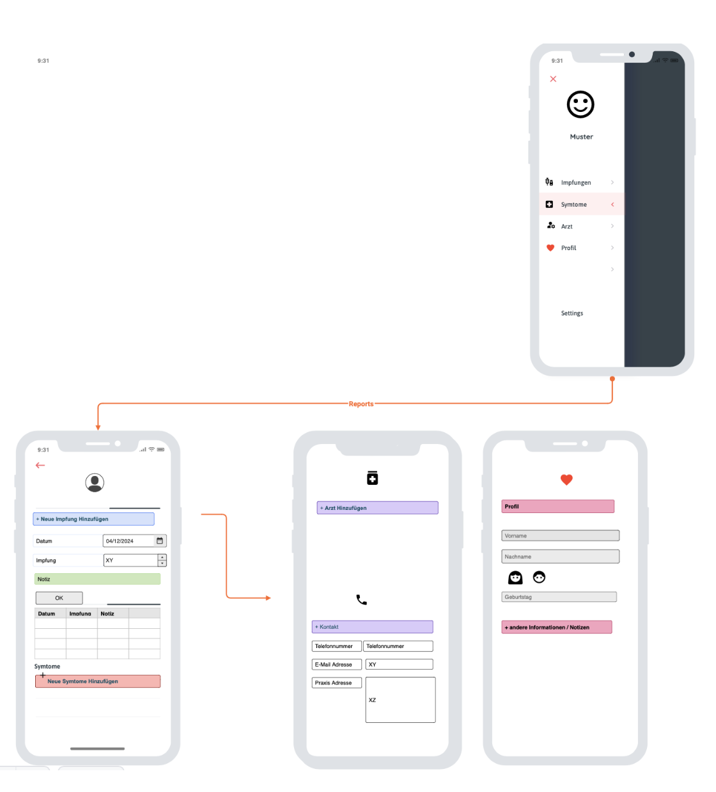
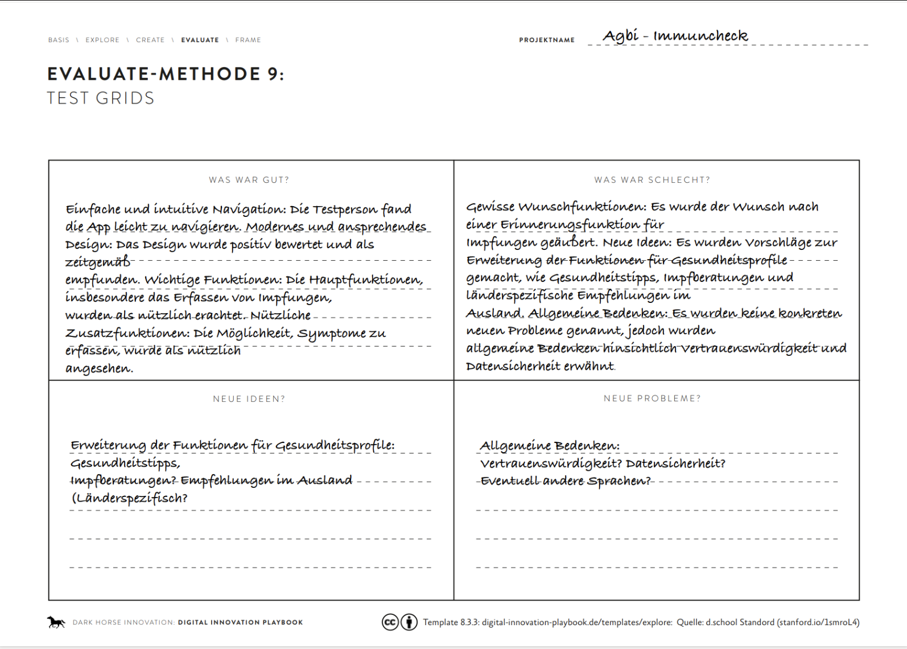
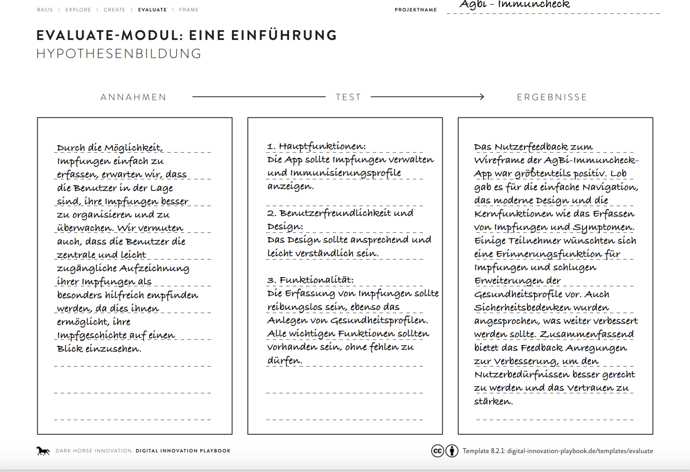
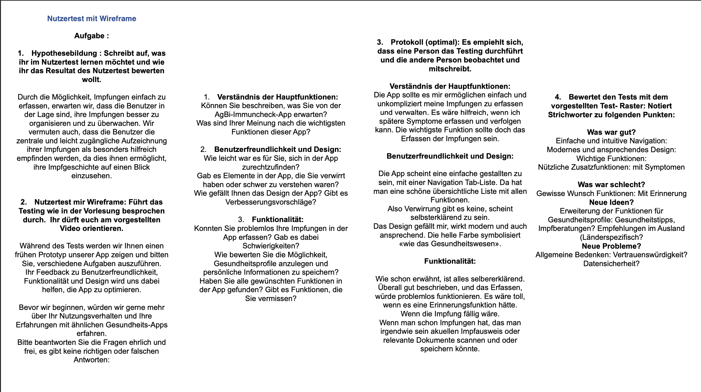

# AgBi-Immuncheck

Unsere App AgBi- Immuncheck bietet eine benutzerfreundliche Plattform zur Erfassung und Verwaltung von Impfungen sowie zur Überwachung von Symptomen im Zusammenhang mit den Impfungen. Entwickelt, für Einzelpersonen, ermöglicht unsere Anwendung eine einfache und sichere Verwaltung von Impfdaten und Gesundheitsinformationen. 

Benutzer können ihre Impfungen in der App erfassen, einschließlich des Impfstoffs, des Datums und des Impforts. Dies bietet eine zentrale und leicht zugängliche Aufzeichnung aller erhaltenen Impfungen.
Die App ermöglicht es den Benutzern, Profile anzulegen und personenbezogene Informationen wie Name, Geburtsdatum und medizinische Vorgeschichte zu speichern. Dies ermöglicht eine individuelle Anpassung der Impf- und Gesundheitsverwaltung.

https://agbi-immuncheck.streamlit.app

## Persona 

## Wireframes

## Nutztest 1  

## Nutztest 2 

## Nutztest 4 

